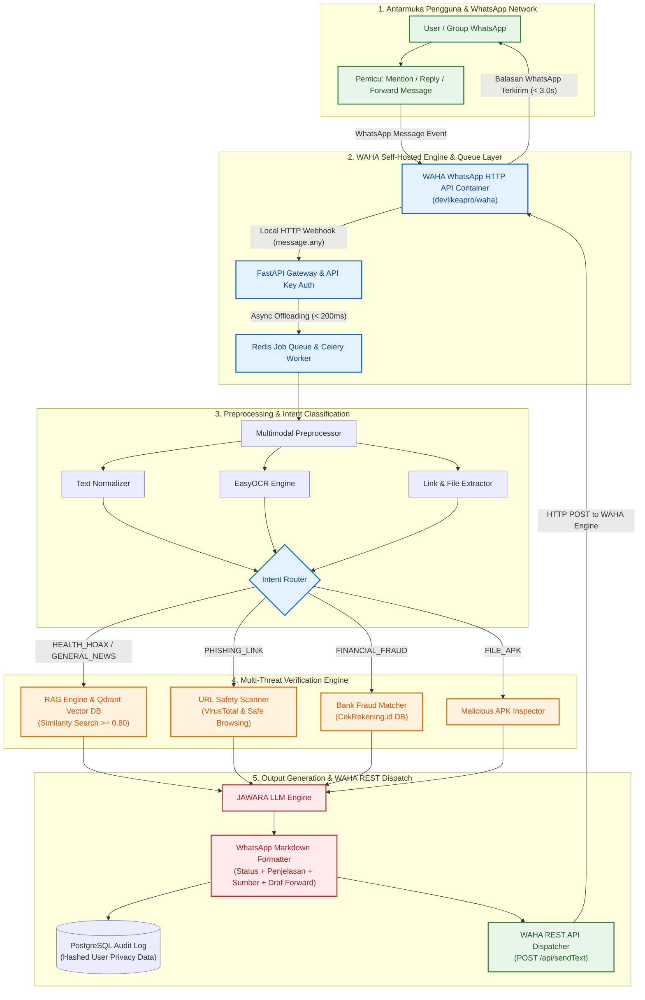

# Cara Kerja Sistem & Flowchart Utama (Proposal Paper Reference)

Dokumen ini memuat **Flowchart Utama Cara Kerja Sistem JAWARA: Jaringan Asisten WhatsApp Anti-Rekayasa & Ancaman (Smart Family Guard)** berarsitektur **WAHA (WhatsApp HTTP API) Self-Hosted** yang dirancang menggunakan Mermaid Markdown. Diagram dan penjelasan di bawah ini disesuaikan untuk dapat digunakan langsung pada **Proposal Paper / Karya Tulis Gemastik 2026 (Cabang Software Development)**.

---

## 1. Flowchart Utama Cara Kerja Sistem (Mermaid Diagram)

---

## 2. Keterangan Flowchart untuk Proposal Paper

Penjelasan alur kerja di bawah ini dapat dikutip atau disesuaikan untuk bagian **Bab III / Metode Pengembangan & Cara Kerja Sistem** pada naskah proposal paper:

### Tahap 1: Pengiriman Pesan & Inisiasi (*User-Initiated Trigger*)
* Pengguna WhatsApp (individu maupun anggota grup keluarga) meneruskan (*forward*), mereply, atau menyebut (*mention*) bot **JAWARA** saat menerima pesan mencurigakan, baik berupa teks klaim, gambar flyer, link tautan, file `.APK`, maupun nomor rekening bank.
* Sistem bekerja secara *consent-based*, artinya enkripsi *End-to-End* WhatsApp tetap terjaga penuh karena sistem hanya memproses pesan yang secara sadar dikirimkan oleh pengguna.

### Tahap 2: WAHA Webhook Ingestion & Antrean Asinkron (*WAHA Async Queue*)
* Container **WAHA (WhatsApp HTTP API)** yang di-host mandiri (*self-hosted via Docker*) menerima event pesan dari WhatsApp network dan langsung mengirimkan HTTP POST Webhook event (`message.any`) ke **FastAPI Gateway**.
* Gateway memverifikasi keaslian request menggunakan API Key header (`X-Api-Key`).
* Untuk mencegah kebocoran antrean (*timeout* webhook), Gateway memberikan respon instan `HTTP 200 OK` dalam $< 200\text{ ms}$ dan melemparkan tugas pemrosesan berat ke **Redis Job Queue** untuk dieksekusi secara asinkron oleh **Celery Workers**.

### Tahap 3: Pemrosesan Multimodal & Klasifikasi Niat (*Preprocessing & Intent Router*)
* Worker membedakan tipe masukan:
  - **Teks:** Dibersihkan dari karakter aneh dan dinormalisasi (*Text Normalizer*).
  - **Gambar:** Teks diekstraksi menggunakan mesin **EasyOCR / Tesseract**.
  - **Link/File/Rekening:** Ekstraksi komponen URL, header file, atau digit nomor rekening.
* **Intent Router** menentukan kategori ancaman utama ke dalam salah satu dari 5 domain: `HEALTH_HOAX`, `FINANCIAL_FRAUD`, `GENERAL_NEWS`, `PHISHING_LINK`, atau `FILE_APK`.

### Tahap 4: Verifikasi Ancaman Berbasis Multi-Engine (*Deep Verification*)
* **RAG Vector Search (Qdrant DB):** Teks klaim diubah menjadi *vector embedding* (1536-dim / 768-dim) dan dibandingkan dengan basis data fakta terverifikasi (*Cosine Similarity* $\ge 0.80$).
* **URL Safety Scanner:** Memindai reputasi link secara *real-time* via Google Safe Browsing API & VirusTotal.
* **Bank Fraud Matcher:** Mengecek identitas rekening/e-wallet ke basis data kejahatan finansial (CekRekening.id & database internal).
* **Malicious APK Inspector:** Memeriksa struktur header file untuk mendeteksi virus penipuan berwujud aplikasi Android.

### Tahap 5: Formulasi Balasan Empatik & WAHA Dispatch (*Output Generation & WAHA REST Dispatch*)
* **JAWARA LLM Engine** menyusun pesan balasan dengan persona yang hangat, sopan ("Bapak/Ibu"), dan mudah dipahami lansia.
* Balasan diformat dalam 4 bagian standar WhatsApp Markdown:
  1. **Status Risiko:** 🔴 *HOAKS/BAHAYA TINGGI*, 🟡 *WASPADA*, atau 🟢 *FAKTA RESMI/AMAN*.
  2. **Penjelasan Empatik:** Maksimal 4 kalimat sederhana tanpa istilah teknis yang rumit.
  3. **Referensi Resmi:** Tautan sumber terpercaya (Kemenkes, TurnBackHoax, Kominfo, CekRekening).
  4. **Draf Balasan Siap Forward (`> ...`):** Teks klarifikasi santun yang mudah di-copy/forward pengguna ke grup keluarga.
* Transaksi dicatat secara anonim di **PostgreSQL** (`message_logs`) menggunakan hash SHA-256 untuk perlindungan privasi.
* Pesan dikirimkan kembali ke WhatsApp melalui endpoint **WAHA REST API** (`POST /api/sendText`) dengan estimasi waktu total $< 3.0\text{ detik}$.

---

**Related:** [[01_System_Architecture]] · [[02_Data_Pipeline]] · [[01_LLM_System_Prompt]]
