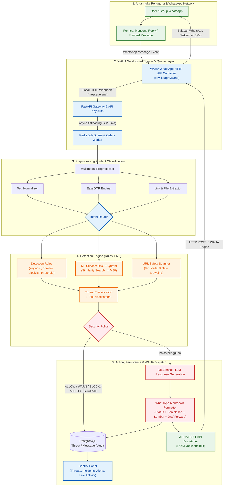

# Cara Kerja Sistem & Flowchart Utama (Proposal Paper Reference)

Dokumen ini memuat **Flowchart Utama Cara Kerja Sistem JAWARA: Jaringan Asisten WhatsApp Anti-Rekayasa & Ancaman** yang dirancang menggunakan Mermaid Markdown. Diagram dan penjelasan di bawah ini disesuaikan untuk dapat digunakan langsung pada **Proposal Paper / Karya Tulis Gemastik 2026 (Cabang Software Development)**.

> **Status:** tahap 1–2 (intake, auth, rate limit, queue, worker) sudah berjalan. Tahap 3–5 masih **Planned**. Diagram teknis lengkap beserta pemilik tiap tahap ada di [[02_Data_Pipeline]]; klasifikasi scope per fitur di [[05_Product_Scope_and_Roadmap]].

---

## 1. Flowchart Utama Cara Kerja Sistem (Mermaid Diagram)

---

## 2. Keterangan Flowchart untuk Proposal Paper

Penjelasan alur kerja di bawah ini dapat dikutip atau disesuaikan untuk bagian **Bab III / Metode Pengembangan & Cara Kerja Sistem** pada naskah proposal paper:

### Tahap 1: Pengiriman Pesan & Inisiasi (*User-Initiated Trigger*)
* Pengguna WhatsApp (individu maupun anggota grup keluarga) meneruskan (*forward*), mereply, atau menyebut (*mention*) bot **JAWARA** saat menerima pesan mencurigakan, baik berupa teks klaim, gambar flyer, link tautan, file `.APK`, maupun nomor rekening bank.
* Sistem bekerja secara *consent-based*, artinya enkripsi *End-to-End* WhatsApp tetap terjaga penuh karena sistem hanya memproses pesan yang secara sadar dikirimkan oleh pengguna.

### Tahap 2: WAHA Webhook Ingestion & Antrean Asinkron (*WAHA Async Queue*)
* Container **WAHA (WhatsApp HTTP API)** yang di-host mandiri (*self-hosted via Docker*) menerima event pesan dari WhatsApp network dan langsung mengirimkan HTTP POST Webhook event (`message.any`) ke **FastAPI Gateway**.
* Gateway memverifikasi keaslian request menggunakan API Key header (`X-Api-Key`).
* Untuk mencegah kebocoran antrean (*timeout* webhook), Gateway memberikan respon instan `HTTP 200 OK` dalam $< 200\text{ ms}$ dan melemparkan tugas pemrosesan berat ke **Redis Job Queue** untuk dieksekusi secara asinkron oleh **Celery Workers**.

### Tahap 3: Pemrosesan Multimodal & Klasifikasi Niat (*Preprocessing & Intent Router*)
* Worker membedakan tipe masukan:
  - **Teks:** Dibersihkan dari karakter aneh dan dinormalisasi (*Text Normalizer*).
  - **Gambar:** Teks diekstraksi menggunakan mesin **EasyOCR / Tesseract**.
  - **Link/File/Rekening:** Ekstraksi komponen URL, header file, atau digit nomor rekening.
* **Intent Router** menentukan kategori ancaman utama ke dalam salah satu dari 5 domain: `HEALTH_HOAX`, `FINANCIAL_FRAUD`, `GENERAL_NEWS`, `PHISHING_LINK`, atau `FILE_APK`.

### Tahap 4: Deteksi Berbasis Rules + ML (*Detection Engine*)

Dua mekanisme berjalan berdampingan dan saling melengkapi — bukan saling menggantikan ([[03_Detection_Rules]]):

* **Detection Rules (deterministik):** keyword, domain, pola URL, repeat offender, allowlist/blocklist, dan risk threshold. Bisa diubah operator kapan saja tanpa melatih ulang model.
* **ML Analysis (probabilistik, dijalankan ML Service):** klasifikasi ancaman beserta *confidence* dan `model_version`. Bila dibutuhkan konteks pengetahuan, ML Service melakukan retrieval ke Qdrant (*Cosine Similarity* $\ge 0.80$) sebelum inference — parameter model tidak berubah karenanya ([[03_Knowledge_Base]]).
* **URL Safety Scanner:** memindai reputasi link via Google Safe Browsing API & VirusTotal (*Planned*). Kegagalan API eksternal tidak memblokir pipeline; indicator ditandai `unknown`.
* Keluaran keduanya digabung menjadi **Threat Classification + Risk Assessment**, lalu dievaluasi oleh **Security Policy** yang menentukan aksi: `ALLOW`, `WARN`, `BLOCK`, `ALERT`, atau `ESCALATE` ([[02_Security_Policies]]).

*Di luar scope MVP:* pengecekan rekening penipu (CekRekening.id) adalah **Post-MVP**; analisis statik file `.APK` adalah **Opsional / Future** ([[06_Optional_APK_Inspector]]). Lampiran `.apk` tetap dideteksi dan diperingatkan di MVP.

### Tahap 5: Aksi, Pencatatan & WAHA Dispatch (*Action, Persistence & Dispatch*)
* Bila policy meminta respons ke pengguna, **ML Service** menyusun pesan balasan dengan persona yang hangat, sopan ("Bapak/Ibu"), dan mudah dipahami lansia.
* Balasan diformat dalam 4 bagian standar WhatsApp Markdown:
  1. **Status Risiko:** 🔴 *HOAKS/BAHAYA TINGGI*, 🟡 *WASPADA*, atau 🟢 *FAKTA RESMI/AMAN*.
  2. **Penjelasan Empatik:** Maksimal 4 kalimat sederhana tanpa istilah teknis yang rumit.
  3. **Referensi Resmi:** Tautan sumber terpercaya (Kemenkes, TurnBackHoax, Kominfo, CekRekening).
  4. **Draf Balasan Siap Forward (`> ...`):** Teks klarifikasi santun yang mudah di-copy/forward pengguna ke grup keluarga.
* Transaksi dicatat secara anonim di **PostgreSQL** (`message_logs`) menggunakan hash SHA-256 untuk perlindungan privasi. Threat, keterkaitan incident, alert, dan entri audit ditulis pada tahap yang sama (*Planned*).
* Pesan dikirimkan kembali ke WhatsApp melalui endpoint **WAHA REST API** (`POST /api/sendText`) dengan estimasi waktu total $< 3.0\text{ detik}$.
* Hasilnya muncul di **Control Panel**: Command Center, Live Activity, Threat Monitoring, dan Incident Management ([[01_Control_Panel_Overview]]).

---

**Related:** [[01_System_Architecture]] · [[02_Data_Pipeline]] · [[01_LLM_System_Prompt]] · [[02_Security_Policies]] · [[03_Detection_Rules]] · [[01_Control_Panel_Overview]]
