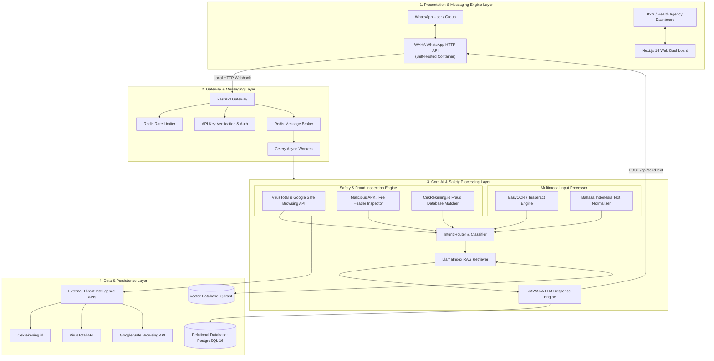
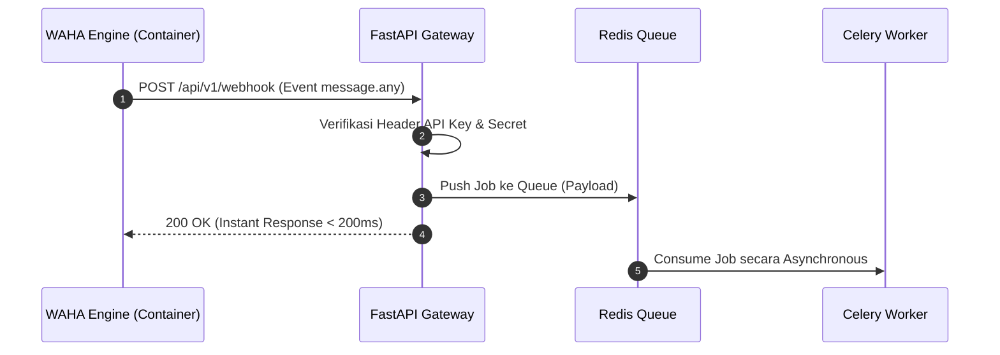
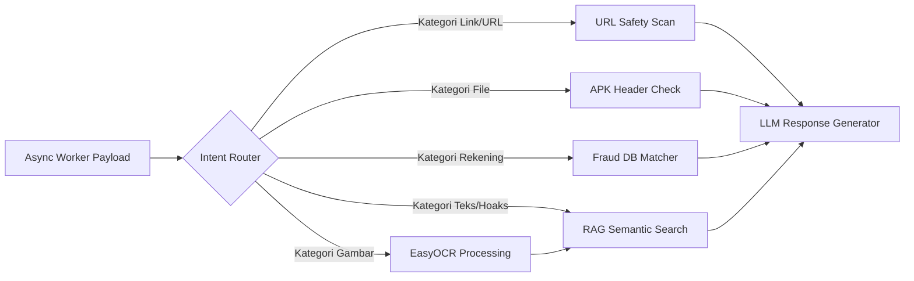

# Arsitektur Sistem (4-Layer Production Architecture)

Sistem **JAWARA: Jaringan Asisten WhatsApp Anti-Rekayasa & Ancaman** dirancang menggunakan arsitektur **Modular Monolith yang Containerized (Docker-Ready)** berbasis engine **WAHA (WhatsApp HTTP API)** self-hosted untuk menjamin performa tinggi, efisiensi biaya (bebas biaya per pesan Meta), dan privasi data lokal.

---

## High-Level System Architecture Diagram

---

## 1. Presentation & Messaging Engine Layer

Layer antarmuka pengguna dan engine messaging yang di-host mandiri (*self-hosted*).

| Komponen | Spesifikasi & Tanggung Jawab |
| :--- | :--- |
| **WhatsApp Client** | Interface utama end-user (HP lansia/keluarga). Menerima pesan teks, flyer gambar, link, file APK, atau nomor rekening. |
| **WAHA WhatsApp API Engine** | Container Docker (`devlikeapro/waha`) yang menghubungkan sistem ke jaringan WhatsApp Web/Engine. Mengirim webhook lokal & menyediakan REST API endpoint (`POST /api/sendText`, `/api/sendMedia`). |
| **Next.js 14 Frontend** | Dashboard analitik web berbasis React/TailwindCSS untuk memantau aktivitas sistem. |
| **B2G Health Dashboard** | Interface khusus instansi pemerintah untuk melihat *spatial heatmap* sebaran hoaks kesehatan & penipuan. |

---

## 2. Gateway & Messaging Layer

Mengelola beban trafik masuk, keamanan webhook lokal, dan pengantrean tugas agar tidak memblokir respon webhook WAHA.

* **FastAPI Gateway:** Asynchronous web framework berbasis Python 3.11+.
* **Redis Rate Limiter:** Mencegah spamming dan serangan DDOS dari nomor WhatsApp tertentu.
* **Celery Worker Pool:** Memproses analisis AI secara paralel di latar belakang.

---

## 3. Core AI & Safety Processing Layer

Pusat kecerdasan buatan dan pemindaian keamanan multi-vektor.

---

## 4. Data & Persistence Layer

* **PostgreSQL 16:** Relational database untuk menyimpan metadata fakta (`fact_items`), log pesan anonim (`message_logs`), pendaftaran pengguna (`user_subscriptions`), dan rekening penipu (`fraud_blacklists`).
* **Vector Database (Qdrant):** Menyimpan *vector embedding* dari dokumen fakta terverifikasi dengan struktur indeks HNSW.

---

**Related:** [[04_How_it_Works]] · [[02_Data_Pipeline]] · [[03_Tech_Stack]] · [[01_PostgreSQL_Schema]]