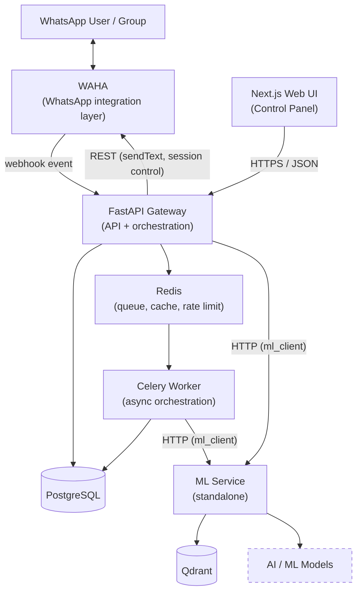

# Arsitektur Sistem JAWARA (Target Architecture)

**JAWARA — Jaringan Asisten WhatsApp Anti-Rekayasa & Ancaman** adalah *WhatsApp-oriented security platform*: mendeteksi, menganalisis, memantau, dan merespons pesan mencurigakan, penipuan, phishing, social engineering, dan ancaman digital lain yang beredar di WhatsApp.

Dokumen ini mendeskripsikan **arsitektur target**. Sebagian sudah berjalan, sebagian masih rencana — status per komponen ada di §7 dan di [[05_Product_Scope_and_Roadmap]].

> Per 2026-08-08, seluruh kotak pada diagram di bawah sudah ada kodenya di repo, termasuk ML Service dan Control Panel. Yang tersisa adalah kedalaman tiap komponen, bukan keberadaannya.

---

## 1. High-Level Architecture

```text
                         JAWARA PLATFORM
                              │
                              ▼
                    ┌───────────────────┐
                    │   Next.js Web UI  │
                    │  Control Panel    │
                    └─────────┬─────────┘
                              │
                              ▼
                    ┌───────────────────┐
                    │   FastAPI Gateway │
                    │      API Layer    │
                    └─────────┬─────────┘
                              │
              ┌───────────────┼────────────────┐
              │               │                │
              ▼               ▼                ▼
        PostgreSQL          Redis            Qdrant
              │               │                │
              └───────────────┼────────────────┘
                              │
                              ▼
                    ┌───────────────────┐
                    │    ML Service     │
                    │    Standalone     │
                    └─────────┬─────────┘
                              │
                              ▼
                    ┌───────────────────┐
                    │   AI / ML Models  │
                    └───────────────────┘

                    WhatsApp Integration
                              │
                              ▼
                            WAHA
```

Versi Mermaid dengan arah panggilan yang eksplisit:



Garis putus-putus = komponen yang masih **Planned** (belum ada kodenya di repo). Tersisa satu: model ML terlatih — ML Service sudah berjalan dengan embedder deterministik dan komposer respons, tapi belum ada model klasifikasi hasil training.

---

## 2. Prinsip Arsitektur

1. **Separation of Concerns.** FastAPI mengurus API dan orkestrasi bisnis. ML Service mengurus beban ML. Tidak ada logika inferensi yang ditanam di dalam route gateway.
2. **Independent ML Lifecycle.** Model bisa berevolusi tanpa mengubah aplikasi API. Versi model adalah data, bukan deploy ulang gateway.
3. **Controlled Model Deployment.** Training selesai ≠ model masuk produksi. Promosi ke produksi selalu tindakan eksplisit.
4. **Knowledge Is Not Training.** Update Knowledge Base tidak mengubah parameter model. Lihat [[03_Knowledge_Base]].
5. **Human-in-the-Loop.** Koreksi operator masuk ke kurasi dataset yang terkontrol, bukan langsung ke model produksi.
6. **Auditable Security Actions.** Keputusan keamanan dan operasi administratif harus bisa ditelusuri. Lihat [[05_Audit_Logs]].
7. **Explicit Feature Prioritization.** MVP / Post-MVP / Opsional / Deferred dipisahkan secara eksplisit di [[05_Product_Scope_and_Roadmap]].

---

## 3. Tanggung Jawab per Komponen

### 3.1 Next.js Frontend — Control Panel

Antarmuka operator. Bertanggung jawab atas UI untuk: dashboard, threat monitoring, message inspection, incident management, WhatsApp session management, user management, security policy, alert management, Knowledge Base, dataset management, training job, model management, audit log, autentikasi, dan navigasi yang sadar-role.

Batasan keras:

- Frontend **hanya** berbicara ke FastAPI Gateway.
- Frontend **tidak** memanggil ML Service, Qdrant, Redis, PostgreSQL, atau WAHA secara langsung.

Detail per layar: [[01_Control_Panel_Overview]].

### 3.2 FastAPI Gateway — API Layer

Gateway backend tunggal. Bertanggung jawab atas:

| Domain | Tanggung jawab |
| :--- | :--- |
| Akses | Authentication, authorization, RBAC, request validation |
| Routing | API routing, versioning, error contract |
| Bisnis | Orkestrasi business logic, user management, threat management, incident management, security policy management, alert management |
| Jejak | Audit logging |
| Integrasi | WhatsApp session management (via WAHA), komunikasi ke ML Service |
| AI/ML | Knowledge Base management, dataset management, training job orchestration, model registry orchestration |
| Data | Komunikasi ke PostgreSQL, Redis, dan Qdrant seperlunya |

Gateway **mengorkestrasi** operasi ML; implementasi ML tidak tinggal di dalamnya.

### 3.3 ML Service — Standalone

Service independen, stateless, tidak pernah dipanggil langsung dari frontend. Bertanggung jawab atas ML inference, model loading & execution, preprocessing khusus ML, pembuatan embedding, pemrosesan dataset untuk ML, training, evaluation, pembuatan artefak model, dan eksperimentasi ML.

Arah panggilan yang benar:

```text
Frontend  →  FastAPI  →  ML Service
```

Bukan:

```text
Frontend  →  ML Service
```

Detail kontrak dan batasan: [[04_ML_Service]].

### 3.4 PostgreSQL — Primary Persistent Store

Sistem pencatatan relasional utama. Domain data: users, roles, permissions, WhatsApp sessions, threats, message metadata, incidents, alerts, security policies, detection rules, knowledge metadata, dataset metadata, training jobs, model metadata, audit logs, operator feedback.

Schema dan status per tabel: [[01_PostgreSQL_Schema]].

### 3.5 Redis — Transient & High-Speed

Antrean, background job, state sementara, caching, rate limiting, koordinasi job, dan state transient terkait sesi.

**Redis bukan database persisten utama.** Data yang harus bertahan hidup lintas restart adalah milik PostgreSQL.

### 3.6 Qdrant — Vector Retrieval

Embedding dokumen, knowledge chunk, semantic search, similarity retrieval, dan retrieval untuk RAG.

**Qdrant bukan database relasional utama.** Metadata knowledge (judul, sumber, status, siapa yang meng-upload) tinggal di PostgreSQL; Qdrant menyimpan vektor dan payload retrieval-nya. Lihat [[02_VectorDB_Specifications]].

### 3.7 WAHA — WhatsApp Integration Layer

Service integrasi WhatsApp (self-hosted, `devlikeapro/waha`). Perannya: menghubungkan sesi WhatsApp, menerima pesan/event, mengirim pesan, mengelola state sesi, dan menangani siklus QR/pairing.

Operasi frontend terhadap sesi WhatsApp **selalu lewat FastAPI**. Internal WAHA tidak diekspos ke frontend. Lihat [[05_Integrations]].

---

## 4. Alur Deteksi Utama (ringkas)

```text
WhatsApp → WAHA → FastAPI → Message Processing → Rules + ML Analysis
        → Threat Classification → Risk Assessment → Security Policy
        → Action → Threat / Incident / Audit Data → Dashboard
```

Rincian tiap tahap, termasuk alur RAG, knowledge ingestion, dan training: [[02_Data_Pipeline]].

---

## 5. Rules dan ML Saling Melengkapi

Deteksi JAWARA bertumpu pada dua mekanisme yang **tidak menggantikan satu sama lain**:

| Mekanisme | Sifat | Kekuatan |
| :--- | :--- | :--- |
| Detection Rules (deterministik) | Keyword, domain, URL, threshold, pola, repeat offender, allowlist/blocklist | Bisa dijelaskan, bisa diubah instan, tidak butuh retraining |
| ML Classification (probabilistik) | Klasifikasi + confidence + risk score | Menangkap variasi bahasa dan modus baru yang tidak tercover rule |

Keduanya menyuplai Risk Assessment; Security Policy yang memutuskan aksi akhir. Lihat [[03_Detection_Rules]] dan [[02_Security_Policies]].

---

## 6. Boundary Enforcement

- Gateway hanya boleh memanggil ML Service lewat satu modul client (`backend/app/clients/ml_client.py`, **Planned**). Tidak ada route/service lain yang boleh tahu URL atau schema ML Service.
- ML Service tidak boleh mengambil alih peran API bisnis: tidak ada endpoint user management, tidak ada endpoint incident, tidak menerima trafik dari frontend.
- Qdrant diakses dari sisi ML Service untuk operasi retrieval/embedding; gateway tidak menghitung atau membandingkan embedding sendiri.

---

## 7. Status Implementasi per Komponen

| Komponen | Status | Bukti / catatan |
| :--- | :--- | :--- |
| WAHA container | Implemented | `docker-compose.yml`, healthcheck + volume sesi |
| FastAPI Gateway (intake) | Implemented | webhook, auth `X-Api-Key`, rate limit, health, orkestrasi pipeline, API Control Panel di belakang sesi operator |
| Redis (queue + rate limit + cache) | Implemented | `app/core/rate_limit.py`, `app/services/queue.py`, `app/core/cache.py` |
| Celery Worker | Implemented | pipeline lengkap: preprocessing → rules → verifikasi → generate → dispatch → audit (`app/pipeline/orchestrator.py`) |
| PostgreSQL | Partial | migrasi `001_init_schema.sql` dipakai penuh (`message_logs` terisi); tabel domain keamanan & AI/ML belum ada |
| Qdrant | Implemented | collection + payload index + embedding knowledge terisi lewat ingestion |
| ML Service | Partial | `ml-service/` ada: `embed`, `rag-query`, `generate`, `kb/upsert`, `health`, `ready`. `classify` menjawab `model_not_available` (belum ada model terlatih); `ocr` dan `train`/`evaluate` belum ada |
| Next.js Control Panel | Partial | login operator + shell sidebar + Command Center + Service Health; layar lain belum ada, RBAC belum ada |

Rincian batasan tiap komponen: [[00_Sprint_1_Completion_Notes]].

---

## 8. Arsitektur Historis

Versi sebelumnya mendeskripsikan **Modular Monolith 4-layer** dengan OCR, RAG, LLM, dan seluruh safety engine berjalan **di dalam** proses FastAPI/Celery, serta produk bernama **CucuDigital**. Arsitektur itu sudah tidak berlaku: ML dipisahkan ke service sendiri. Rekaman analisis pemisahannya ada di [[02_Architecture_Audit_ML_Decoupling]] (dokumen historis).

---

**Related:** [[04_ML_Service]] · [[02_Data_Pipeline]] · [[03_Tech_Stack]] · [[05_Integrations]] · [[05_Product_Scope_and_Roadmap]] · [[01_PostgreSQL_Schema]]
