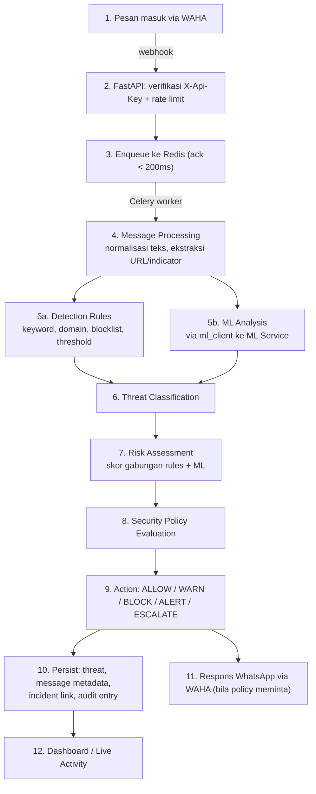

# Data Flow & Pipeline

Dokumen ini menjelaskan empat alur data utama JAWARA: **deteksi operasional**, **inference dengan konteks AI**, **knowledge ingestion**, dan **training**. Keempatnya sengaja dipisahkan karena masing-masing punya pemicu, aktor, dan konsekuensi yang berbeda.

Status: alur intake (tahap 1–3 pada §1) sebagian sudah berjalan; sisanya **Planned**. Lihat [[05_Product_Scope_and_Roadmap]].

---

## 1. Alur Operasional Utama (Message → Action)

```text
WhatsApp
    ↓
WAHA
    ↓
FastAPI
    ↓
Message Processing
    ↓
Rules + ML Analysis
    ↓
Threat Classification
    ↓
Risk Assessment
    ↓
Security Policy
    ↓
Action
    ↓
Threat / Incident / Audit Data
    ↓
Dashboard
```



### Tahap 1–3 — Intake & Offloading (Implemented)

1. WAHA mengirim event (`message.any`, `session.status`) ke `POST /api/v1/webhook`.
2. Gateway memverifikasi header `X-Api-Key`, lalu menerapkan rate limit sliding-window Redis per `(session, chat_id)` — default 20 request / 60 detik, balas `429` + `Retry-After` bila terlampaui.
3. Gateway membalas `200 OK` cepat dan melempar payload ke Redis queue; Celery worker mengonsumsi secara asinkron. Rate limiter **fail open** bila Redis tidak reachable (kegagalan dicatat di log).

### Tahap 4 — Message Processing (Planned)

Normalisasi teks Bahasa Indonesia, ekstraksi URL/domain, ekstraksi indicator (nomor rekening, nomor telepon), deteksi tipe lampiran. OCR gambar dijalankan di ML Service, bukan di worker gateway.

### Tahap 5 — Rules + ML (Planned)

Dua jalur berjalan berdampingan:

- **Detection Rules** dievaluasi di gateway/worker — deterministik, murah, bisa diubah tanpa retraining ([[03_Detection_Rules]]).
- **ML Analysis** dipanggil ke ML Service lewat `ml_client` — klasifikasi + confidence + `model_version` ([[04_ML_Service]]).

### Tahap 6–7 — Klasifikasi & Risk Assessment (Planned)

Kategori ancaman awal: Phishing, Scam, Social Engineering, Malicious Link, Impersonation, Spam, Other Suspicious Activity ([[03_Threat_Monitoring]]). Risk score adalah gabungan sinyal rules dan ML, bukan output ML mentah.

### Tahap 8–9 — Policy & Action (Planned)

Security Policy memetakan (kategori, risk score, indicator, konteks user) ke satu aksi: `ALLOW`, `WARN`, `BLOCK`, `ALERT`, `ESCALATE` ([[02_Security_Policies]]). Aksi dan evaluasinya tercatat di audit trail.

### Tahap 10–12 — Persist & Surface (Planned)

Threat, metadata pesan, keterkaitan incident, alert, dan audit entry ditulis ke PostgreSQL, lalu tampil di Control Panel dan Live Activity ([[02_Command_Center]]).

---

## 2. Alur Inference dengan Konteks AI (RAG)

Dipakai saat klasifikasi/penjelasan membutuhkan konteks pengetahuan.

```text
Message
    ↓
FastAPI
    ↓
ML Service
    ↓
Knowledge Retrieval
    ↓
Qdrant
    ↓
Context
    ↓
ML / AI Inference
    ↓
Classification
```

Catatan penting: retrieval **tidak** mengubah parameter model. Yang berubah hanya konteks yang disuplai ke inference. Lihat [[03_Knowledge_Base]].

---

## 3. Alur Knowledge Ingestion

```text
Admin Upload
    ↓
FastAPI
    ↓
File Validation
    ↓
Document Parsing
    ↓
Chunking
    ↓
Embedding Generation
    ↓
Qdrant
    ↓
Knowledge Available for Retrieval
```

**Upload knowledge tidak me-retrain model.** Dokumen yang di-upload juga tidak otomatis dianggap tepercaya — validasi tipe file, ukuran, dan status review berlaku sebelum knowledge dipakai untuk retrieval ([[06_Platform_Security_Requirements]]).

---

## 4. Alur Training Data

```text
Message / Curated Data
        ↓
Operator Feedback
        ↓
Dataset Curation
        ↓
Dataset Validation
        ↓
Training Job
        ↓
ML Service
        ↓
Evaluation
        ↓
Candidate Model
        ↓
Model Registry
        ↓
Manual Validation
        ↓
Production Model
```

Jalur berikut **tidak** ada dan tidak boleh diimplementasikan:

```text
Operator Feedback  →  Production Model
```

Setiap anak panah di atas adalah gerbang, bukan formalitas. Rinciannya di [[05_Training_Jobs]] dan [[08_Continuous_Improvement_Loop]].

---

## 5. Knowledge vs Training — perbandingan cepat

| | Knowledge Base | Model Training |
| :--- | :--- | :--- |
| Input | Dokumen (PDF, DOCX, TXT, CSV) | Dataset berlabel |
| Proses | Parse → chunk → embed → simpan | Train → evaluate → artifact |
| Penyimpanan hasil | Qdrant (vektor) + PostgreSQL (metadata) | Model registry |
| Parameter model | **Tidak berubah** | **Berubah** |
| Efek | Langsung terasa di retrieval berikutnya | Baru terasa setelah promosi ke produksi |
| Pemicu | Upload operator | Training job eksplisit |

---

## 6. Error Handling & Degradasi

| Kegagalan | Perilaku |
| :--- | :--- |
| Sesi WAHA terputus | WAHA reconnect otomatis; event `session.status` masuk ke gateway dan memicu alert `MEDIUM` ([[04_Alert_Center]], Planned) |
| Broker Redis mati | Webhook tetap balas `200` dengan header `X-Queued: 0`; kegagalan enqueue tercatat sebagai `enqueue failed` di log gateway (event tersebut hilang) |
| Redis mati saat rate limiting | Limiter fail open — request diteruskan, kegagalan di-log |
| ML Service tidak reachable | Gateway jatuh ke jalur rules-only; ancaman tetap dicatat, klasifikasi ditandai `ml_unavailable`, alert `MEDIUM` dinaikkan (Planned) |
| Qdrant tidak reachable | Retrieval dilewati; inference berjalan tanpa konteks knowledge dan ditandai low-confidence (Planned) |
| Job payload malformed | Task Celery membuang job (non-retryable) — retry tidak akan mengubah bentuk payload |

---

**Related:** [[01_System_Architecture]] · [[04_ML_Service]] · [[03_Knowledge_Base]] · [[05_Training_Jobs]] · [[02_Security_Policies]] · [[02_VectorDB_Specifications]]
