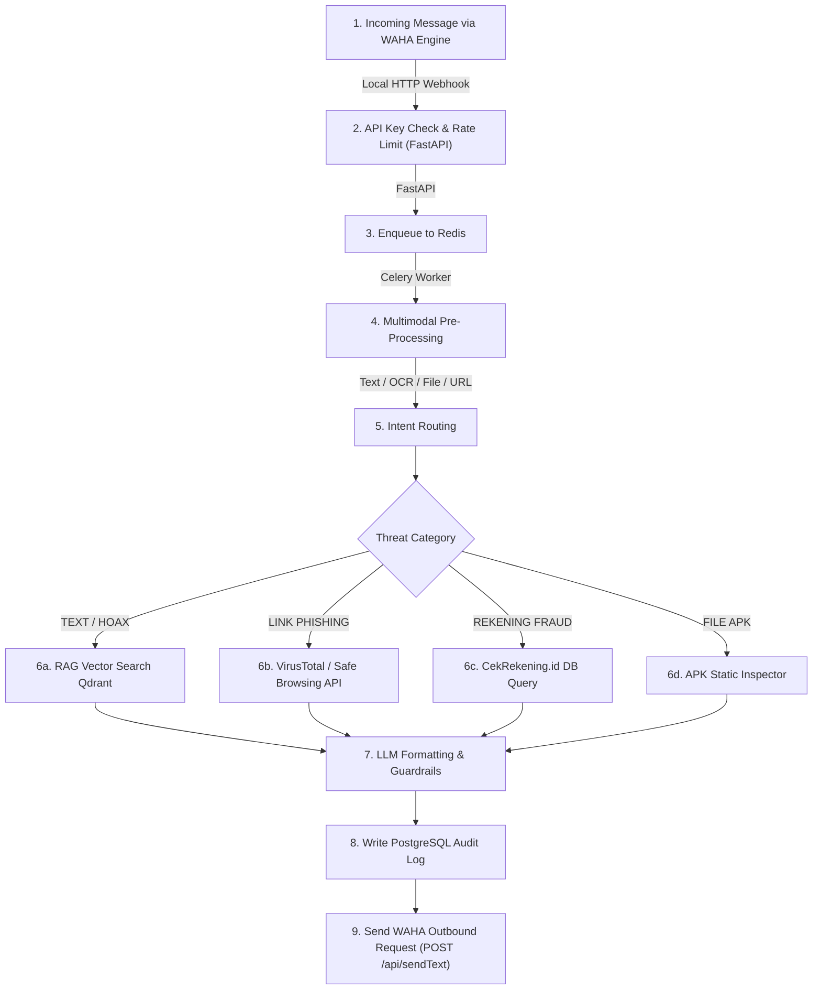

# Data Pipeline & Sequence Flow

Dokumen ini menjelaskan alur data komprehensif (*end-to-end data pipeline*) dari saat pengguna mengirimkan pesan di WhatsApp, diproses oleh engine **WAHA (WhatsApp HTTP API)** self-hosted, hingga balasan terverifikasi terkirim kembali.

---

## 1. High-Level Pipeline Flow

---

## 2. Rincian Tahapan Pemrosesan (Step-by-Step)

### Tahap 1: WAHA Webhook Ingestion & Offloading (< 200 ms)
1. **WAHA Container Webhook:** Container `devlikeapro/waha` menerima event `message.any` dari jaringan WhatsApp dan mengirimkan HTTP POST Webhook ke endpoint FastAPI `/api/v1/webhook`.
2. **Authenticity Check:** Gateway memverifikasi signature/header secret `X-Api-Key`.
3. **Async Queue Offloading:** FastAPI langsung merespon WAHA dengan `HTTP 200 OK` dalam kurun waktu $< 200\text{ ms}$ untuk menghindari retries, lalu melempar payload ke Redis Queue.

### Tahap 2: Pre-Processing & Intent Classification
1. **Pemeriksaan Tipe Input:**
   - **Teks:** Dicuci melalui kata dasar normalizer Bahasa Indonesia.
   - **Gambar:** Dikirim ke EasyOCR / Tesseract engine untuk diekstraksi teks flyer/infografis.
   - **Tautan (URL):** Ditarik string URL utamanya dan diperiksa apakah menggunakan pemendek link (bit.ly, tinyurl, dll).
   - **File Dokumen:** Diperiksa mime-type dan ekstensi file (khususnya `.apk`).
   - **Nomor Rekening:** Diekstrak digit angka dan nama bank/e-wallet.
2. **Klasifikasi Intent:** Classifier menentukan satu dari 5 kategori utama:
   `HEALTH_HOAX`, `FINANCIAL_FRAUD`, `GENERAL_NEWS`, `PHISHING_LINK`, `FILE_APK`.

### Tahap 3: Deep Verification Engine
1. **Jika `HEALTH_HOAX` / `GENERAL_NEWS` (RAG Search):**
   - Teks input diubah menjadi embedding vector menggunakan `text-embedding-3-small` (1536 dim) atau `IndoBERT` (768 dim).
   - Melakukan *Cosine Similarity Search* pada koleksi Qdrant `fact_knowledge_base`.
   - Jika skor kemiripan $\ge 0.80$, *fact context* diambil. Jika $< 0.80$, sistem menandai sebagai *Unverified/Low Confidence*.
2. **Jika `PHISHING_LINK`:**
   - URL dipindai secara *real-time* ke Google Safe Browsing API & VirusTotal API v3.
3. **Jika `FINANCIAL_FRAUD` (Rekening):**
   - Nomor rekening dicek terhadap basis data `fraud_blacklists` di PostgreSQL dan API CekRekening.id.
4. **Jika `FILE_APK`:**
   - Inspector mendeteksi file bermodus instalasi aplikasi berbahaya di luar Play Store.

### Tahap 4: LLM Response & WAHA Outbound Dispatch
1. **LLM Generation:** Context hasil verifikasi disisipkan ke System Prompt JAWARA (Jaringan Asisten WhatsApp Anti-Rekayasa & Ancaman). LLM menghasilkan pesan dalam struktur 4 bagian WhatsApp Markdown.
2. **Audit Logging:** Transaksi dicatat secara anonim di tabel PostgreSQL `message_logs`.
3. **Outbound Dispatch:** Celery Worker memanggil REST API WAHA `POST http://waha:3000/api/sendText` dengan payload JSON `{ "chatId": "...", "text": "..." }` untuk mengirim balasan pesan.

---

## 3. Strategi Error Handling & Fallback

* **WAHA Disconnection / Re-session:** Jika sesi WhatsApp di WAHA terputus, WAHA memiliki mekanisme *automatic session reconnect* dan notifikasi status sesi via webhook `/api/v1/session/status`.
* **LLM API Downtime / Timeout:** Jika LLM mengalami timeout $> 5\text{ detik}$, sistem secara otomatis mengalihkan balasan ke *fallback static template* berbasis hasil RAG murni.
* **Vector DB Unavailable:** Jika Qdrant tidak dapat dijangkau, sistem menggunakan pencarian teks sederhana (PostgreSQL `ILIKE` / Full-Text Search) sebagai cadangan.

---

**Related:** [[01_System_Architecture]] · [[04_How_it_Works]] · [[02_VectorDB_Specifications]] · [[01_LLM_System_Prompt]]