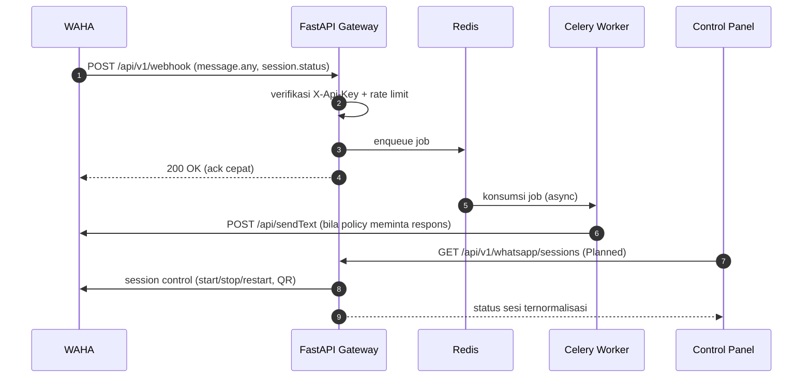

# Integrations

Dokumen ini mengumpulkan seluruh integrasi eksternal/internal JAWARA beserta batas aksesnya.

---

## 1. WAHA — WhatsApp Integration Layer

**Status:** Implemented (container + webhook intake). UI manajemen sesi: Planned ([[06_WhatsApp_Management]]).

WAHA (`devlikeapro/waha`, self-hosted) adalah lapisan integrasi WhatsApp. Perannya:

- Menghubungkan sesi WhatsApp
- Menerima pesan dan event
- Mengirim pesan (bila didukung engine/sesi)
- Mengelola state sesi
- Menangani siklus QR / pairing

### Arah komunikasi

### Aturan batas

- Frontend **tidak pernah** memanggil WAHA langsung. Semua operasi sesi lewat FastAPI.
- Internal WAHA (bentuk payload mentah, endpoint engine, dashboard WAHA) tidak diekspos ke frontend. Gateway menormalkan bentuknya.
- `WAHA_API_KEY` adalah satu-satunya lapisan auth webhook saat ini — rotasi berkala, jangan dipakai ulang antar environment.

---

## 2. ML Service (internal)

**Status:** Planned. Lihat [[04_ML_Service]] untuk kontrak lengkap.

- Diakses hanya oleh gateway/worker lewat `backend/app/clients/ml_client.py`.
- Autentikasi internal API key, jaringan Docker internal, tidak terekspos publik.

---

## 3. Data Store

| Store | Akses dari | Peran |
| :--- | :--- | :--- |
| PostgreSQL | Gateway, worker | Sistem pencatatan relasional utama ([[01_PostgreSQL_Schema]]) |
| Redis | Gateway, worker | Queue, cache, rate limit, koordinasi job, state transient |
| Qdrant | ML Service (retrieval), script bootstrap gateway (setup collection) | Vector retrieval / knowledge chunk ([[02_VectorDB_Specifications]]) |

---

## 4. Threat Intelligence Eksternal

**Status:** Planned. Dua integrasi ini menyuplai sinyal indicator, bukan keputusan akhir — policy yang memutuskan aksi.

| Integrasi | Dipakai untuk | Catatan |
| :--- | :--- | :--- |
| Google Safe Browsing API | Reputasi URL/domain | Rate limit dan kuota harian perlu di-cache di Redis agar tidak dipanggil ulang untuk URL yang sama |
| VirusTotal API v3 | Reputasi URL/domain/file hash | Kuota free tier ketat; cache hasil dan hormati backoff |

Kegagalan atau timeout API eksternal **tidak boleh** memblokir pipeline: indicator ditandai `unknown`, deteksi berjalan dengan sinyal yang tersisa.

---

## 5. Integrasi yang Disebut di Dokumen Historis

| Integrasi | Status sekarang |
| :--- | :--- |
| CekRekening.id (pengecekan rekening penipu) | **Post-MVP.** Tabel `fraud_blacklists` sengaja tidak dibuat di migrasi 001 — lihat [[01_PostgreSQL_Schema]]. |
| APK static analysis service | **Opsional / Future.** Lihat [[06_Optional_APK_Inspector]]. |
| Dedicated Analytics Service | **Deferred.** Bukan komponen inti. Lihat [[05_Product_Scope_and_Roadmap]]. |

---

**Related:** [[01_System_Architecture]] · [[04_ML_Service]] · [[06_WhatsApp_Management]] · [[06_Platform_Security_Requirements]] · [[02_Prod_Environtment]]
