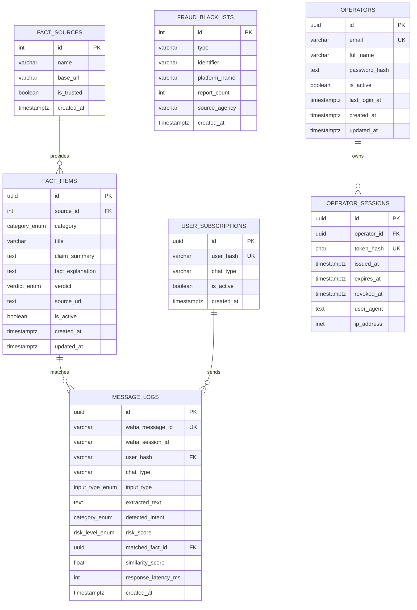

# Relational Database Schema (PostgreSQL)

PostgreSQL 16 adalah **primary persistent relational data store** JAWARA — sistem pencatatan untuk seluruh data operasional platform.

---

## 0. Domain Data & Status

Arsitektur target menempatkan domain berikut di PostgreSQL. Sebagian besar **belum ada tabelnya**; yang ada sekarang hanya schema pipeline pesan generasi pertama (§ERD di bawah).

| Domain data | Status | Catatan |
| :--- | :--- | :--- |
| Operator accounts + sesi login | Implemented | `operators` + `operator_sessions` (migrasi 002). Email + password, sesi berumur pendek. **Tanpa role/permission** — RBAC tetap Planned |
| Roles, permissions | Planned | Prasyarat RBAC ([[07_Users_and_Risk]]) |
| WhatsApp sessions | Planned | Metadata sesi; state hidupnya tetap milik WAHA |
| Threats | Planned | [[03_Threat_Monitoring]] |
| Message metadata | Implemented | `message_logs` ada **dan terisi** oleh worker setelah setiap pesan diproses ([[Create Audit Logging]]) |
| Incidents | Planned | [[05_Incident_Management]] |
| Alerts | Planned | [[04_Alert_Center]] |
| Security policies | Planned | [[02_Security_Policies]] |
| Detection rules | Planned | [[03_Detection_Rules]] |
| Knowledge metadata | Planned | Vektornya di Qdrant, metadatanya di sini ([[03_Knowledge_Base]]) |
| Dataset metadata | Planned | [[04_Datasets_and_Operator_Feedback]] |
| Training jobs | Planned | [[05_Training_Jobs]] |
| Model metadata | Planned | [[07_Model_Registry_and_Deployment]] |
| Audit logs (aksi operator) | Planned | Berbeda dari `message_logs` ([[05_Audit_Logs]]) |
| Operator feedback | Planned | [[04_Datasets_and_Operator_Feedback]] |
| Fact items / fact sources | Implemented | Basis pengetahuan fakta generasi pertama |
| User subscriptions | Implemented | Pendaftaran chat/grup, identitas ter-hash |

**Catatan terminologi kedua — "operator" vs "user":** tabel login sengaja bernama `operators`, bukan `users`. Di schema ini `user_hash` sudah berarti **pengguna akhir WhatsApp**, yang anonim by design dan tidak pernah punya akun. Dua arti "user" dalam satu schema pada akhirnya akan bertemu di satu query.

**Catatan terminologi:** `category_enum` saat ini memuat kategori pipeline generasi pertama (`HEALTH_HOAX`, `FINANCIAL_FRAUD`, `GENERAL_NEWS`, `PHISHING_LINK`, `FILE_APK`). Kategori ancaman Control Panel (Phishing, Scam, Social Engineering, Malicious Link, Impersonation, Spam, Other) belum dipetakan ke enum ini — **keputusan terbuka**: perluas enum, ganti dengan tabel referensi, atau pertahankan dua level (intent pipeline vs kategori ancaman).

---

## Entity Relationship Diagram (ERD)



`OPERATORS` berdiri terpisah dari `USER_SUBSCRIPTIONS` dan tidak punya relasi ke sana — memang tidak boleh ada. Operator adalah manusia yang membuka Control Panel; `user_hash` adalah pengguna WhatsApp yang identitasnya sengaja tidak pernah disimpan.

---

## PostgreSQL DDL (Data Definition Language) Script

```sql
-- ==========================================================
-- Extension Setup
-- ==========================================================
CREATE EXTENSION IF NOT EXISTS "pgcrypto";

-- ==========================================================
-- ENUM Types Definition
-- ==========================================================
CREATE TYPE category_enum AS ENUM (
    'HEALTH_HOAX',
    'FINANCIAL_FRAUD',
    'GENERAL_NEWS',
    'PHISHING_LINK',
    'FILE_APK'
);

CREATE TYPE verdict_enum AS ENUM (
    'HOAX',
    'FACT',
    'MISLEADING',
    'UNVERIFIED'
);

CREATE TYPE risk_level_enum AS ENUM (
    'HIGH',
    'MEDIUM',
    'LOW',
    'UNKNOWN'
);

CREATE TYPE input_type_enum AS ENUM (
    'TEXT',
    'IMAGE_OCR',
    'URL_LINK',
    'FILE_APK',
    'BANK_ACCOUNT'
);

-- ==========================================================
-- 1. Fact Sources Table
-- ==========================================================
CREATE TABLE fact_sources (
    id SERIAL PRIMARY KEY,
    name VARCHAR(100) NOT NULL,
    base_url VARCHAR(255) NOT NULL,
    is_trusted BOOLEAN DEFAULT TRUE,
    created_at TIMESTAMPTZ DEFAULT CURRENT_TIMESTAMP
);

-- ==========================================================
-- 2. Fact Items Table
-- ==========================================================
CREATE TABLE fact_items (
    id UUID PRIMARY KEY DEFAULT gen_random_uuid(),
    source_id INT REFERENCES fact_sources(id) ON DELETE SET NULL,
    category category_enum NOT NULL,
    title VARCHAR(255) NOT NULL,
    claim_summary TEXT NOT NULL,
    fact_explanation TEXT NOT NULL,
    verdict verdict_enum NOT NULL,
    source_url TEXT NOT NULL,
    is_active BOOLEAN DEFAULT TRUE,
    created_at TIMESTAMPTZ DEFAULT CURRENT_TIMESTAMP,
    updated_at TIMESTAMPTZ DEFAULT CURRENT_TIMESTAMP
);

-- Trigger untuk mengupdate updated_at secara otomatis
CREATE OR REPLACE FUNCTION update_updated_at_column()
RETURNS TRIGGER AS $$
BEGIN
   NEW.updated_at = CURRENT_TIMESTAMP;
   RETURN NEW;
END;
$$ language 'plpgsql';

CREATE TRIGGER update_fact_items_modtime
    BEFORE UPDATE ON fact_items
    FOR EACH ROW
    EXECUTE PROCEDURE update_updated_at_column();

-- ==========================================================
-- 3. Fraud Blacklists Table
-- ==========================================================
CREATE TABLE fraud_blacklists (
    id SERIAL PRIMARY KEY,
    type VARCHAR(20) NOT NULL CHECK (type IN ('BANK_ACCOUNT', 'E_WALLET', 'PHONE_NUMBER')),
    identifier VARCHAR(100) NOT NULL,
    platform_name VARCHAR(50),
    report_count INT DEFAULT 1 CHECK (report_count >= 1),
    source_agency VARCHAR(100) DEFAULT 'CekRekening.id / Internal Report',
    created_at TIMESTAMPTZ DEFAULT CURRENT_TIMESTAMP
);

-- ==========================================================
-- 4. User Subscriptions / Registration Table
-- ==========================================================
CREATE TABLE user_subscriptions (
    id UUID PRIMARY KEY DEFAULT gen_random_uuid(),
    user_hash VARCHAR(64) UNIQUE NOT NULL, -- SHA-256 (Phone / Group ID + Salt)
    chat_type VARCHAR(20) NOT NULL CHECK (chat_type IN ('PERSONAL', 'GROUP')),
    is_active BOOLEAN DEFAULT TRUE,
    created_at TIMESTAMPTZ DEFAULT CURRENT_TIMESTAMP
);

-- ==========================================================
-- 5. Message Logs Table (Audit Trail Anonim WAHA Engine)
-- ==========================================================
CREATE TABLE message_logs (
    id UUID PRIMARY KEY DEFAULT gen_random_uuid(),
    waha_message_id VARCHAR(100) UNIQUE NOT NULL,
    waha_session_id VARCHAR(50) DEFAULT 'default',
    user_hash VARCHAR(64) NOT NULL REFERENCES user_subscriptions(user_hash) ON DELETE CASCADE,
    chat_type VARCHAR(20) NOT NULL CHECK (chat_type IN ('PERSONAL', 'GROUP')),
    input_type input_type_enum NOT NULL,
    extracted_text TEXT,
    detected_intent category_enum,
    risk_score risk_level_enum DEFAULT 'UNKNOWN',
    matched_fact_id UUID REFERENCES fact_items(id) ON DELETE SET NULL,
    similarity_score FLOAT CHECK (similarity_score >= 0.0 AND similarity_score <= 1.0),
    response_latency_ms INT,
    created_at TIMESTAMPTZ DEFAULT CURRENT_TIMESTAMP
);

-- ==========================================================
-- 6. Operators (akun Control Panel) & Sesi Login
-- Migrasi 002. Bukan `users`: lihat catatan terminologi di §0.
-- ==========================================================
CREATE TABLE operators (
    id UUID PRIMARY KEY DEFAULT gen_random_uuid(),
    email VARCHAR(255) NOT NULL,
    full_name VARCHAR(120) NOT NULL,
    password_hash TEXT NOT NULL,          -- bcrypt; TEXT karena prefix algoritma + cost ikut disimpan
    is_active BOOLEAN NOT NULL DEFAULT TRUE,
    last_login_at TIMESTAMPTZ,
    created_at TIMESTAMPTZ NOT NULL DEFAULT CURRENT_TIMESTAMP,
    updated_at TIMESTAMPTZ NOT NULL DEFAULT CURRENT_TIMESTAMP
);

-- Unik pada lower(email): alamat email case-insensitive di dunia nyata, dan dua
-- akun yang beda hanya di kapitalisasi adalah trik pengambilalihan akun.
CREATE UNIQUE INDEX idx_operators_email_lower ON operators (lower(email));

CREATE TRIGGER update_operators_modtime
    BEFORE UPDATE ON operators
    FOR EACH ROW
    EXECUTE PROCEDURE update_updated_at_column();

CREATE TABLE operator_sessions (
    id UUID PRIMARY KEY DEFAULT gen_random_uuid(),
    operator_id UUID NOT NULL REFERENCES operators(id) ON DELETE CASCADE,
    token_hash CHAR(64) UNIQUE NOT NULL,  -- SHA-256 token, bukan tokennya
    issued_at TIMESTAMPTZ NOT NULL DEFAULT CURRENT_TIMESTAMP,
    expires_at TIMESTAMPTZ NOT NULL,
    revoked_at TIMESTAMPTZ,
    user_agent TEXT,
    ip_address INET
);

-- ==========================================================
-- Indexing Strategy
-- ==========================================================
CREATE INDEX idx_operator_sessions_operator ON operator_sessions(operator_id);
CREATE INDEX idx_operator_sessions_expires ON operator_sessions(expires_at);
CREATE INDEX idx_message_logs_created_at ON message_logs(created_at DESC);
CREATE INDEX idx_message_logs_intent ON message_logs(detected_intent);
CREATE INDEX idx_message_logs_user_hash ON message_logs(user_hash);
CREATE INDEX idx_fraud_blacklists_identifier ON fraud_blacklists(identifier);
CREATE INDEX idx_fact_items_category ON fact_items(category) WHERE is_active = TRUE;
```

---

## Implementasi & Migrasi

DDL di atas adalah *source of truth*. Bentuk yang benar-benar dijalankan ada di `backend/app/db/migrations/` — `001_init_schema.sql` (pipeline pesan) dan `002_operator_auth.sql` (akun + sesi operator) — di-apply oleh `uv run python -m app.db.migrate` (lihat [[Design PostgreSQL Schema]]).

Tiga perbedaan yang disengaja antara dokumen ini dan migrasi 001:

| Hal | Alasan |
|---|---|
| `fraud_blacklists` **tidak** dibuat | Verifikasi penipuan finansial adalah **Post-MVP**. Tabel kosong hanya mengiklankan kemampuan yang belum ada. Ada test yang memastikan tabel ini tetap absen. |
| Semua statement di-guard (`IF NOT EXISTS`, `DO $$ … EXCEPTION WHEN duplicate_object`) | Migrasi harus bisa diulang di CI dan di database yang setengah teraplikasi. Enum tidak punya `CREATE TYPE IF NOT EXISTS`, jadi dibungkus blok `DO`. |
| Ada tabel tambahan `schema_migrations` | Ledger versi migrasi (`version`, `checksum`, `applied_at`). Bukan bagian dari model domain. |

**Kenapa sesi disimpan sebagai row, bukan JWT:** token bertanda tangan tidak bisa dicabut tanpa denylist, dan denylist adalah tabel sesi yang menyamar. Satu lookup terindeks per request membeli logout yang benar-benar mencabut, plus "nonaktifkan akun ini sekarang" yang berlaku di request berikutnya. Yang disimpan hanya SHA-256 tokennya — dump database tidak membagikan sesi hidup. SHA-256 cukup (bukan bcrypt) karena token adalah 32 byte acak: tidak ada yang bisa ditebak, dan hash lambat per request hanya menambah latensi.

**Konvensi `user_hash`:** `sha256(USER_HASH_SALT + ':' + nomor_atau_group_id)`, hex lowercase 64 karakter — implementasinya di `backend/app/core/hashing.py`. Salt tunggal level aplikasi (bukan per-row), karena `user_hash` harus reproducible dari chat ID mentah supaya bisa jadi lookup key antar pesan. Ganti salt = seluruh `user_subscriptions` lama tidak match lagi dan `message_logs`-nya ikut terhapus lewat cascade.

**Catatan trigger `updated_at`:** `CURRENT_TIMESTAMP` adalah waktu **mulai transaksi**, bukan waktu statement. Insert lalu update di dalam satu transaksi menghasilkan `updated_at` yang identik; perubahannya baru terlihat antar transaksi. Pakai `clock_timestamp()` kalau suatu saat butuh presisi per statement.

---

**Peringatan privasi:** `message_logs.extracted_text` menyimpan isi pesan dalam plaintext dan belum punya retention policy. Ini isu terbuka berprioritas tinggi — lihat [[01_Threat_Model_and_Data_Protection]] §5.1.

Sejak 2026-08-08 kolom itu benar-benar terisi, jadi isunya berhenti bersifat teoretis. Mitigasi sementara: `LOG_MESSAGE_CONTENT=false` mematikan penulisan kolom tersebut tanpa mengorbankan sisa jejak audit (intent, risiko, similarity, latensi). Itu saklar, bukan pengganti retention policy — lihat [[Create_Audit_Logging]].

---

**Related:** [[01_System_Architecture]] · [[02_Data_Pipeline]] · [[02_VectorDB_Specifications]] · [[Design PostgreSQL Schema]] · [[05_Audit_Logs]] · [[01_Threat_Model_and_Data_Protection]]