# Vector Database Schema & Config (Qdrant)

Qdrant menangani **vector-based retrieval dan kemampuan semantic knowledge**: document embedding, knowledge chunk, semantic search, similarity retrieval, dan retrieval untuk RAG.

Batasan peran:

- Qdrant **bukan** database relasional utama. Metadata knowledge (judul dokumen, sumber, pengunggah, status review, versi) tinggal di PostgreSQL ([[01_PostgreSQL_Schema]]).
- Akses retrieval berada di belakang **ML Service**; gateway tidak menghitung atau membandingkan embedding sendiri ([[04_ML_Service]] §5).
- Isi Knowledge Base tidak mengubah parameter model ([[03_Knowledge_Base]]).

**Status:** Implemented. Collection `fact_knowledge_base` dan payload index-nya dibuat oleh `backend/app/vector/qdrant_setup.py`, dan **sudah terisi embedding** lewat `backend/app/scripts/ingest_knowledge.py` → `POST /v1/kb/upsert`. Retrieval berjalan di `ml-service/app/rag/qdrant_repo.py` dengan bentuk query persis seperti §3.

Yang masih Planned: pipeline ingestion **dokumen** (upload PDF/DOCX operator, parsing, chunking) — ingestion yang ada sekarang membaca `fact_items` dari PostgreSQL, bukan file ([[03_Knowledge_Base]]).

---

## 1. Collection Configuration

| Property | Configuration Value | Keterangan / Justifikasi |
| :--- | :--- | :--- |
| **Collection Name** | `fact_knowledge_base` | Koleksi utama penyimpanan embedding fakta. |
| **Distance Metric** | `Cosine` | Mengukur sudut kemiripan semantik antar vektor teks. |
| **Vector Dimension** | `1536` | Disesuaikan dengan model `text-embedding-3-small` OpenAI (atau `768` untuk `IndoBERT`). |
| **HNSW Index M** | `16` | Jumlah koneksi max per node pada grafik HNSW. |
| **HNSW Index ef_construct** | `100` | Kedalaman pencarian grafik saat pembuatan indeks. |
| **On-Disk Payload** | `true` | Menyimpan payload data di disk untuk menghemat RAM. |

---

## 2. Complete Payload Schema (JSON)

```json
{
  "id": "c39a04f2-5b9e-4a6c-9407-1d82136e0510",
  "vector": [
    0.0124,
    -0.0451,
    0.0892,
    "..."
  ],
  "payload": {
    "fact_item_id": "c39a04f2-5b9e-4a6c-9407-1d82136e0510",
    "category": "HEALTH_HOAX",
    "title": "Klaim Daun Kitolod Menyembuhkan Katarak Tanpa Operasi",
    "claim_text": "Beredar pesan bahwa air rebusan atau perasan daun kitolod dapat menyembuhkan katarak dan membersihkan mata tanpa perlu operasi.",
    "fact_explanation": "Kementerian Kesehatan RI dan Perhimpunan Dokter Spesialis Mata Indonesia (PERDAMI) menegaskan bahwa penggunaan air ramuan daun liar pada mata berisiko tinggi menyebabkan iritasi, infeksi bakteri, hingga kebutaan permanen. Katarak hanya dapat ditangani melalui tindakan medis katarak oleh dokter spesialis.",
    "verdict": "HOAX",
    "source_name": "Kementerian Kesehatan RI & TurnBackHoax",
    "source_url": "https://turnbackhoax.id/2026/01/10/hoax-kitolod-katarak/",
    "is_active": true,
    "updated_at": "2026-03-15T10:00:00Z"
  }
}
```

---

## 3. Strategi Hybrid Search & Payload Filtering

Untuk memastikan pencarian yang presisi, RAG JAWARA (Jaringan Asisten WhatsApp Anti-Rekayasa & Ancaman) menerapkan **Hybrid Search** (pencarian vektor dikombinasikan dengan penyaringan metadata):

```python
# Contoh Query Retrieval Qdrant di Python (LlamaIndex / Qdrant Client)
from qdrant_client import QdrantClient
from qdrant_client.http import models

client = QdrantClient(host="localhost", port=6333)

# Lakukan similarity search dengan filter kategori
search_result = client.search(
    collection_name="fact_knowledge_base",
    query_vector=user_embedding_vector,
    query_filter=models.Filter(
        must=[
            models.FieldCondition(
                key="category",
                match=models.MatchValue(value="HEALTH_HOAX")
            ),
            models.FieldCondition(
                key="is_active",
                match=models.MatchValue(value=True)
            )
        ]
    ),
    limit=3, # Top-K=3
    score_threshold=0.80 # Similarity threshold minimum 80%
)
```

> **Threshold dan filter di atas tetap kontrak yang berlaku.** Sejak
> [[03_Knowledge_Base]] §9, `search()` diminta `top_k x 3` kandidat dan
> hasilnya diurutkan ulang oleh ml-service berdasarkan reliabilitas sumber dan
> kesegaran (`app/rag/ranking.py`). Re-ranking **hanya mengubah urutan dan
> memotong ke `top_k`** — ia tidak pernah mengubah match mana yang lolos
> ambang 0.80, dan `score` yang tercatat di audit row tetap cosine similarity
> mentah. Angka turunan dikirim terpisah sebagai `rerank_score`,
> `reliability`, dan `age_days`.

---

## 4. RAG Retrieval Pipeline Diagram

```mermaid
flowchart LR
    Q[User Input Text] --> E[Embedding Model]
    E --> V[Vector Embedding 1536-dim]
    V --> QDB[(Qdrant Vector DB)]

    QDB -->|Cos Similarity >= 0.80| CAND[Kandidat top_k x 3]
    CAND --> RR[Re-ranking: reliability x recency]
    RR --> TOPK[Top-K Fact Contexts]
    TOPK --> PROMPT[System Prompt Assembler]
    PROMPT --> LLM[LLM Generator]
    LLM --> OUT[WhatsApp Markdown Output]
```



---

## 5. Implementasi

Collection dibuat oleh `backend/app/vector/qdrant_setup.py` (`python -m app.vector.qdrant_setup`), memakai `qdrant-client==1.8.2` yang dipin agar cocok dengan server `qdrant/qdrant:v1.8.0`. Script mencetak config live-nya untuk dicocokkan dengan tabel §1.

**Payload index** (tambahan di luar tabel config §1, wajib untuk hybrid search §3):

| Field | Tipe index | Alasan |
| :--- | :--- | :--- |
| `category` | keyword | filter utama query RAG |
| `is_active` | bool | filter utama query RAG |
| `fact_item_id` | keyword | join key 1:1 ke `fact_items.id` di PostgreSQL |
| `verdict` | keyword | filter lanjutan saat menyusun konteks LLM |

Tanpa index, Qdrant melakukan full payload scan tiap query — persis yang membuat `on_disk_payload=true` jadi mahal.

**Idempotency:** collection yang sudah ada tidak dibuat ulang (itu akan menghapus seluruh embedding); hanya payload index yang di-assert ulang.

**Dimensi vektor adalah config (`EMBEDDING_DIM`), bukan konstanta:** `1536` untuk `text-embedding-3-small`, `768` untuk IndoBERT. Qdrant tidak bisa mengubah dimensi collection secara in-place — pindah model berarti buat ulang collection dan embed ulang seluruh knowledge base.

**Point id = `fact_items.id`.** Konsekuensinya: re-ingest fakta yang sudah diedit memperbarui vektornya di tempat, bukan meninggalkan kembaran basi yang masih bisa terambil retrieval. Join 1:1 ke PostgreSQL jadi trivial.

**Embedder default bersifat leksikal.** `EMBEDDING_PROVIDER=hash` (`hash-embed-v0`) tidak butuh API key dan deterministik, tapi mengukur kemiripan leksikal — bukan semantik. Threshold 0.80 karenanya berperilaku lebih ketat daripada nanti dengan `text-embedding-3-small`: parafrase longgar akan dijawab "belum terverifikasi", bukan dicocokkan. Angka terukur ada di [[Build_Text_Verification_Pipeline]] §3.

---

**Related:** [[02_Data_Pipeline]] · [[01_PostgreSQL_Schema]] · [[01_LLM_System_Prompt]] · [[Create Qdrant Collection]] · [[03_Knowledge_Base]] · [[04_ML_Service]]